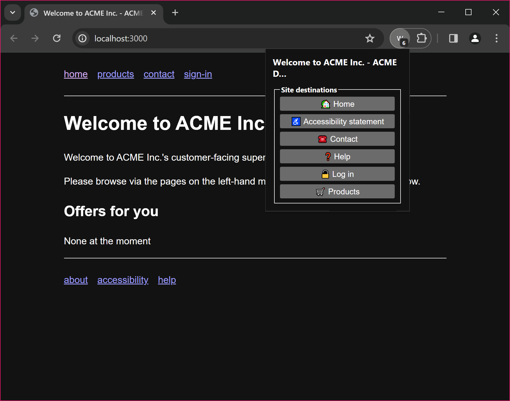

# WAI-Adapt: Discoverable Destinations Explainer

## Authors

- Matthew Tylee Atkinson (@matatk), Samsung Electronics

## Participate

* Issues: https://github.com/w3c/adapt/issues
* Discussions: https://github.com/w3c/adapt/discussions

## Contents

<!-- toc -->

- [Introduction](#introduction)
- [Motivating Use Cases](#motivating-use-cases)
- [Out of scope](#out-of-scope)
- [User research](#user-research)
- [Technical requirements](#technical-requirements)
- [The "Discoverable Destinations" approach](#the-discoverable-destinations-approach)
  * [The discoverable destination namespace](#the-discoverable-destination-namespace)
  * [Enumerating discoverable destinations](#enumerating-discoverable-destinations)
  * [Defining a site](#defining-a-site)
  * [Visiting a discoverable destination directly](#visiting-a-discoverable-destination-directly)
  * [Updating a discoverable destination](#updating-a-discoverable-destination)
  * [Expressing when a link points to part of a discoverable destination](#expressing-when-a-link-points-to-part-of-a-discoverable-destination)
  * [Demarcating destination content](#demarcating-destination-content)
- [Open Questions](#open-questions)
  * [Indicating the _kind_ of content](#indicating-the-_kind_-of-content)
  * [Discoverability and repetition](#discoverability-and-repetition)
  * [Demarcating sub-sites](#demarcating-sub-sites)
- [Security \& Privacy considerations](#security--privacy-considerations)
- [Alternatives considered](#alternatives-considered)
  * [Well-known URIs](#well-known-uris)
  * [Sitemaps](#sitemaps)
  * [Using `rel` attribute values alone](#using-rel-attribute-values-alone)
  * [Linksets](#linksets)
    + [The discoverable destination namespace](#the-discoverable-destination-namespace-1)
    + [Enumerating discoverable destinations](#enumerating-discoverable-destinations-1)
    + [Defining a site](#defining-a-site-1)
    + [Visiting a discoverable destination directly](#visiting-a-discoverable-destination-directly-1)
    + [Updating a discoverable destination](#updating-a-discoverable-destination-1)
    + [Expressing when a link points to part of a discoverable destination](#expressing-when-a-link-points-to-part-of-a-discoverable-destination-1)
    + [Demarcating destination content](#demarcating-destination-content-1)
- [Stakeholder feedback/opposition](#stakeholder-feedbackopposition)
- [References \& acknowledgements](#references--acknowledgements)
  * [Foundational and related work](#foundational-and-related-work)
    + [Destinations](#destinations)
    + [Link types/relations](#link-typesrelations)
    + [Linksets](#linksets-1)

<!-- tocstop -->

## Introduction

<!-- _[Overall WAI-Adapt Explainer](README.md)_ -->

Web sites can contain a huge array of varied and engaging content. This content, and the means of navigating around it, can be presented in almost any way, which makes for tailored and compelling experiences. However, whilst there are several conventions when it comes to navigation, this variability can pose challenges to certain people&mdash;and user agents acting on their behalf.

This specification aims to address the challenge of making sites more easily navigable for both people (particularly those facing accessibility barriers) and machines. It does this by standardising machine-readable names for common page types. User Agents can then query as to which destinations are supported on a given site (or page of that site), and present this information in an appropriate way for the user.

The User Agent, or a User Agent extension, could provide an interface to allow the user to: view supported common pages using a method, and terminology, that is clear to them; and to request to visit common destination pages directly.

This specification builds upon several existing specifications and registries, as detailed in the [foundational and related work](#foundational-and-related-work) section below.

The motivating use cases, "option 1" approach (using Well-known URIs), and an example end-user UI, are depicted in [our Discoverable Destinations AC 2024 lightning talk](https://w3c.github.io/adapt/presentations/ac2024/).

## Motivating Use Cases

* Supporting people facing cognitive accessibility barriers in navigating sites.

  - This includes mechanisms that can support clear signposting within a User Agent to "standard" or "common" areas of sites that users wish to visit&mdash;e.g. "log in", "products", or the site's accessibility statement.

  - This also includes supporting users and accessibility auditors in quickly discovering the accessibility statement for a site.

* Allowing UAs, or other machines, acting on behalf of users to also find common areas of sites.

## Out of scope

* Specifying the contents of well-known pages, nor the schema of any data to be found in one of the common areas of the site, when they are accessed by machines.

* Specifying the way in which supported well-known pages are displayed to the user.

* Specifying the interface within the UA (or UA extension) by which the user can navigate to supported well-known pages.

Though detailed UI design is out of scope, a proof-of-concept UI for enumerating a site's discoverable destinations is depicted below.



## User research

Our proposed "discoverable destinations" come from work done by the [Cognitive and Learning Disabilities Accessibility Task Force](https://www.w3.org/WAI/GL/task-forces/coga/).

> [!NOTE]
> This is not a complete list&mdash;we are consulting with COGA to update the [destinations that the WAI-Adapt TF inherited from COGA](https://raw.githack.com/w3c/adapt/CR-content-2022-07-26/content/index.html#values-0).

An illustrative set of proposed discoverable destinations is as follows...

* `accessibility-statement` (for the site's [accessibility statement](https://www.w3.org/WAI/planning/statements/))

* `change-password` (as per [A Well-known URL for Changing Passwords](https://www.w3.org/TR/change-password-url/))

* `help` (for the site's main help landing page)

* `log-in`

* `products` (for the site's main product section's landing page)

* `search` (intended for a dedicated search page; a [`search` landmark region](https://www.w3.org/TR/wai-aria-1.2/#search) would be used on any page that contains a search form)

## Technical requirements

Any approach that would solve these user needs must provide the following.

* A way to represent each discoverable destination proposed above.

* A mechanism for discovering all discoverable destinations supported by a site&mdash;to be used when a UA first visits a site on behalf of the user. In order to do this efficiently, it must be possible to make this query in a single HTTP request. The results would be available to the user via the UI of the UA.

* A way to denote the scope of any particular site (or sub-site).

* A procedure for visiting a discoverable destination directly (when the user activates the interface in the UA).

* A mechanism by which a discoverable destination would be updated (by the content author).

* Means to identify when a link on a page takes the user to a sub-page of a discoverable destination page. E.g. a link to the "help on logging in" page (as opposed to the main "help" section landing page, which is where the discoverable destination alone would take the user).

* Means to demarcate an element on the destination page that provides the destination content.

* A way to indicate the _kind_ of content that the destination provides&mdash;e.g. people with cognitive disabilities may need to get help from, or chat to, a human, over the phone, rather than a chatbot, or sending an email.

> [!CAUTION]
> The last of these requirements&mdash;indicating the _kind_ of content or support&mdash;is currently an open question, not addressed by the proposed approach below, but may be addressed in a future iteration of this approach, or by a future WAI-Adapt TF project.

## The "Discoverable Destinations" approach

This involves using the `<link>` element, and custom `rel` attribute values, to signpost discoverable destinations on a site.

### The discoverable destination namespace

All possible discoverable destinations will be registered as `rel` attribute values.

* `accessibility-statement`

* `change-password`

* `help`

* `log-in`

* `products`

* `search`

### Enumerating discoverable destinations

On the site's home page, the destinations supported by the site would be indicated via `<link>` elements. For example:

```html
. . .
<head>
  . . .
  <link rel="accessibility-statement" href="/accessibility-statement">
  <link rel="help" href="/support">
  <link rel="log-in" href="/sign-in">
</head>
```

This will provide an overview of the available destinations.

> [!NOTE]
> All destinations would need to be repeated on all pages of the site. (This is one reason why the URLs in the example begin with `/`).

### Defining a site

Because all destinations are repeated on all pages of a site, if we move to a sub-site, the sub-site will expose all destinations on all of its pages, and thus the UA/AT will be able to present the correct destinations for the sub-site.

### Visiting a discoverable destination directly

* The user selects the discoverable destination in the UI of their UA.

* The corresponding URL is loaded.

### Updating a discoverable destination

The content author would need to ensure that the `<link>` elements sent are correct. In practice this would most likely be managed by the CMS powering the site, which could take the repetition out of the authoring process.

### Expressing when a link points to part of a discoverable destination

When an in-page (anchor, `<a>`) link points to a page that is a sub-page of a discoverable destination (such as the "help on logging in" page, rather than the "help" home page), this can be indicated by adding a `rel`  value to the anchor.

```html
<p>For more details, consult the <a href="/help/signing-in" rel="help">help section on signing in to your account</a>.</p>
```

### Demarcating destination content

As discoverable destinations are normal links, they can make use of fragments to point to certain elements on the destination page.

In addition to fragment identifiers, [ARIA landmark roles](https://www.w3.org/TR/wai-aria-1.2/#landmark_roles) provide a complementary mechanism for both identifying and navigating to content on a destination page. In particular, the `<main>` element (or `role="main"`) demarcates the principal content of the page. When a discoverable destination link does not include a fragment identifier, User Agents and assistive technologies should treat the `<main>` element as the default content boundary for the destination. Content authors are encouraged to ensure that destination pages use the `<main>` element to wrap their primary destination content.

Landmarks also support navigation within a page. A destination page may contain multiple labelled `region` landmarks, each representing a distinct content area. User Agents and assistive technologies can enumerate these landmarks and present them to the user, or navigate directly to a specific region. For example, a help destination page with regions labelled "Getting Started", "Account Settings", and "Billing Support" would allow the user or their agent to jump directly to the relevant section.

The UA/AT can then use this information (and the knowledge that the navigation was via the Discoverable Destination UI) to render the destination page in an appropriate way for the user. This may involve:

* Highlighting the specific relevant part of the page.

* Removing other elements from the rendering of the page to reduce cognitive load.

* Providing additional context or guidance based on the destination type.

## Open Questions

### Indicating the _kind_ of content

The current proposal identifies _where_ a destination is located but does not convey _what kind_ of support or content it offers. This distinction matters for users with cognitive disabilities who may need a specific type of interaction. For instance, a user may need to speak to a human being over the phone rather than engage with a chatbot or submit an email form.

The question is whether, and how, such information should be expressed alongside or within a destination. Possible approaches include:

* Extending the `rel` value vocabulary to include more specific destination subtypes (e.g. `help-human`, `help-chat`), though this risks combinatorial explosion as the number of content kinds grows.

* Using an additional attribute or a companion `<meta>` element to annotate the kind of support offered by a given destination, keeping the destination identifier itself stable.

* Deferring this concern to the destination page itself, where structured data (e.g. schema.org markup) could describe the available support types, leaving it to the UA to interpret and present this.

This remains an open question under active consideration with the COGA Task Force. A resolution is expected to inform a future iteration of this work.

### Discoverability and repetition

The current approach requires all `<link>` destination elements to be repeated in the `<head>` of every page on the site. This has the advantage of simplicity, a UA can read the destinations of the current page without fetching any additional resource. However, it introduces authoring overhead, since every page must be regenerated whenever a destination URL changes.

**The Task Force has agreed to adopt the `<link>` element approach for the first cut of this specification.** This decision reflects that the approach is highly flexible, straightforward to implement by content authors and UAs alike, and builds directly on existing, well-understood HTML mechanisms. The per-page repetition, while an authoring overhead, can be managed in practice by modern CMS tooling.

Several questions remain open for future iterations:

* Should there be a single canonical discovery endpoint (such as a well-known URI) that a UA can consult once per origin, rather than reading destinations from each page? This would reduce per-page overhead but would require an extra HTTP request on first visit.

* If a centralized endpoint is added, how should per-page and per-origin destinations be reconciled when they differ? For instance, a sub-site may legitimately override some destinations declared at the origin level.

* What caching expectations should be set for destination declarations, both in the per-page `<link>` approach and in any centralized discovery document?

The [Linksets](#linksets) alternative described later in this document offers one possible path to centralized discovery and may be revisited in a subsequent iteration.

### Demarcating sub-sites

A site hosted at a single origin may contain functionally distinct sub-sites (for example, a hotel website that hosts both a main booking section and a restaurant section). Each sub-site may wish to declare its own set of destinations that differ from those of the root site.

The `<link>` element approach handles this naturally. Because every page carries its own `<link>` declarations, each sub-site simply includes the destinations relevant to that sub-site on its pages. The UA always reads the destinations from the current page, so:

* **Scope is implicit and automatic.** When the user is on a restaurant sub-site page, that page's `<link>` elements define the applicable destinations. No boundary detection or URL prefix matching is required.

* **Overriding destinations is straightforward.** A sub-site page that declares a different `contact` destination than the root site will naturally present the sub-site's destination to the UA, since the UA always uses the current page's declarations.

* **No additional authoring mechanism is needed.** Content authors control sub-site scoping by controlling which `<link>` elements appear on each set of pages, typically managed through their CMS templates.

The Task Force considers sub-site demarcation to be resolved by the per-page `<link>` approach.

## Security \& Privacy considerations

### Privacy

Discoverable Destinations use standard HTML `<link>` elements that are already part of web pages. No additional user data is collected or transmitted beyond normal web browsing. The approach does not introduce any new tracking mechanisms like User Agents discover destinations by parsing existing page content. Users retain full control over when and how they navigate to discovered destinations through the UA interface.

A UA that exposes a destination list to the user reveals which discoverable destinations a site supports. Since this information is already present in the page's `<head>` and therefore visible to any party that loads the page, no new information is exposed by processing or displaying it.

### Security

All navigation triggered by discoverable destinations uses standard HTTP and HTTPS requests, subject to normal browser security policies. Destination URLs are typically within the same origin as the page declaring them, which reduces cross-origin security concerns.

Content authors are responsible for ensuring that the `href` values in their `<link>` elements point to legitimate, secure pages under their control. A malicious or compromised CMS could inject destination `<link>` elements pointing to phishing pages; however, this is not a new attack surface specific to this proposal. The same risk exists for any link or navigation element present in a page.

UAs and UA extensions that implement a discoverable destination interface should validate that destination URLs share the same origin as the page from which they were discovered, and should present the full URL to the user before navigating, to support informed decision-making.

### Considerations for AI Agents

When AI agents use Discoverable Destinations on behalf of users, the same privacy and security considerations apply as for human users. Additionally:

* Agents should not aggregate or store destination metadata in ways that could be used to profile users' browsing patterns across sites.

* For sensitive operations such as authentication or account changes, human oversight should be maintained. Discoverable Destinations are designed for navigation and content discovery, not for executing complex authenticated operations.

## Alternatives considered

### Well-known URIs

We first explored using [Well-known URIs](https://datatracker.ietf.org/doc/html/rfc8615), which provide a number of useful features. However, there were some important limitations:

* Well-known URIs are linked to an _origin_ which means it's not possible to demarcate sub-sites.

* Well-known URIs are usually managed separately to site content, making it harder for regular content authors to keep them up-to-date.

### Sitemaps

[Sitemaps](https://www.sitemaps.org/) are intended to solve different problems than this work.

* Sitemaps are intended to enumerate all major (and possibly minor) pages; our goal here is to highlight specific common pages that may be provided.

* Sitemaps do not give standard names to certain types of pages; our goal here is to semantically identify the purpose of specific pages, so that the UA can present this information to the user, and so that machines can reach certain pages.

It does not seem like a good fit to try to extend the format of sitemaps to accommodate these requirements.

### Using `rel` attribute values alone

Using `rel` attribute values is part of the proposed spec&mdash;for cases where deep links may be provided into an overall well-known section (e.g. help on a specific topic).

It would be possible to use _only_ `rel` values to highlight discoverable destinations (if they were applied to links to the top-level destination landing pages, and there was a way to denote that a link was to the top-level destination landing page), but this would have the disadvantage that the overall destinations for a particular site could not be determined, nor presented to the user, in a simple and robust way. The user could only discover them if they landed on the right pages.

This would pose the risk that the interface presented by the UA would not give a complete picture of what is available on the site, and thus either not be of great use, or&mdash;worse&mdash;be actively confusing for people to use.

> [!NOTE]
> Open questions:
>
> * How often would footer links cover this? (If often, does that negate the need for this spec?)
>
> * What is the performance cost of parsing all those `rel` attributes every time? (This would be required if the `rel` approach were to be used at all.)

### Linksets

This was the TF's favoured approach pre-TPAC 2024. Linksets are semantically equivalent to the above approach (of using `<link>` elements in the header). They would require some additional authoring work (to create the linkset), and would result in smaller pages, with one extra request for the linkset document (which would cover the whole site).

For now we opt for the above approach of putting all the relevant information in `<link>` elements in the `<head>` of each page, for simplicity. However it would still be possible to use linksets in future.

The following sections mirror those above for the proposed approach, for reference.

#### The discoverable destination namespace

Each destination is part of a vocabulary. As there are several destinations that could be provided by a site, they will be namespaced under a root vocabulary namespace, for example (taking inspiration from GS1's vocabulary)...

    https://w3.org/voc/ia/

Under this namespace are the following proposed URLs (the purpose of each is given in the [user research](#user-research) section above).

* `https://w3.org/voc/ia/accessibility-statement`

* `https://w3.org/voc/ia/change-password`

* `https://w3.org/voc/ia/help`

* `https://w3.org/voc/ia/log-in`

* `https://w3.org/voc/ia/products`

* `https://w3.org/voc/ia/search`

The namespace has been specified as `https://w3.org/voc/ia/`, with "ia" standing for "information architecture". This term matches clauses 2, 4, and 8 of [the definition of "information architecture" as given by Wikipedia](https://en.wikipedia.org/wiki/Information_architecture#Definition). Clause 2 states:

> The art and science of organizing and labeling web sites, intranets, online communities, and software to support findability and usability.

Other options instead of "ia" were considered, including "information-architecture", "structure", and others. However "ia" was both felt to be accurate, and is more concise than the other alternatives.

#### Enumerating discoverable destinations

The first time the user visits the origin, the linkset for the origin, and sub-sites, would be fetched from a well-known URI, such as `/.well-known/ia/linkset`.

> [!NOTE]
> We need to investigate how, on a large site, the linkset documents could be split up to improve performance and/or ease of editing, in the event different teams work on different sub-sites.

#### Defining a site

> [!IMPORTANT]
> This section describes a semantic that would need to be interpreted differently when interpreting a "well-known" linkset.

A linkset document (i.e. the JSON serialization) would be created for the site.

For example, the linkset for a simple site (with no sub-sites), which supports three well-known destinations (`accessibility-statement`, `help`, and `log-in`), may be represented as follows.

```json
{ "linkset":
  [
    { "anchor": "https://acme.biz/",
      "https://w3.org/voc/accessibility-statement": [
        { "href": "https://acme.biz/accessibility" }
      ],
      "https://w3.org/voc/help": [
        { "href": "https://acme.biz/support" }
      ],
      "https://w3.org/voc/log-in": [
        { "href": "https://acme.biz/sign-in" }
      ]
    }
  ]
}
```

Note that the linkset standard allows us to provide links to equivalent pages in other human languages; this is not shown here, for brevity.

Also note that a **UA that supports discoverable destinations would interpret the `anchor` field in a specific way:** Discoverable Destinations are intended to be (sub-)site-wide, so the links relating to the single given `anchor` above would apply to all other URLs that start with the `anchor`'s URL.

A more complex site, which is hosted at one origin, but provides two micro-sites, could be coded as follows. The following example linkset represents a hotel's website that has the following structure.

* A "root" site (for the hotel as a whole) at `acme.hotel`.

* The main hotel website provides an overall `accessibility-statement` and `log-in` destination, and a `contact` destination for the hotel (mainly intended for room bookings).

* There is a "restaurant" micro-site that has its own `contact` page (but inherits the root site's `accessibility-statement` and `log-in` pages).

* There is a "gym" micro-site that has its own `contact` page (but inherits the root site's `accessibility-statement` and `log-in` pages).

```json
{ "linkset":
  [
    { "anchor": "https://acme.hotel/",
      "https://w3.org/voc/accessibility-statement": [
        { "href": "https://acme.hotel/accessibility" }
      ],
      "https://w3.org/voc/contact": [
        { "href": "https://acme.hotel/contact" }
      ],
      "https://w3.org/voc/log-in": [
        { "href": "https://acme.hotel/sign-in" }
      ]
    },
    { "anchor": "https://acme.hotel/restaurant",
      "https://w3.org/voc/contact": [
        { "href": "https://acme.hotel/restaurant/contact" }
      ]
    },
    { "anchor": "https://acme.hotel/gym",
      "https://w3.org/voc/contact": [
        { "href": "https://acme.hotel/gym/contact" }
      ]
    }
  ]
}
```

In this case, the UA would need to interpret the URL structure of the linkset as a tree, and ensure that, when the user is visiting the gym's sub-site, for example, the gym's `contact` page is recognised, but the overall root (hotel) site's `accessibility-statement` would apply.

> [!NOTE]
> The way that the UA presents the underlying tree structure of destinations across the root and sub-sites is out of scope. We envisage a range of UAs, or user preference settings, being created to cater for differing user needs.

#### Visiting a discoverable destination directly

* The user selects the discoverable destination in the UI of their UA.

* The corresponding URL is loaded.

If a destination isn't supported, the UI is expected to _not_ include it.

#### Updating a discoverable destination

The content author would need to update the linkset file, and replace it on the server.

> [!NOTE]
> We need to investigate how, on a large site, the linkset documents could be split up to improve performance and/or ease of editing, in the event different teams work on different sub-sites.

#### Expressing when a link points to part of a discoverable destination

A link could be decorated with a `rel` attribute value that corresponds to the applicable destination.

The UA will know if this link points to the root of the discoverable destination (e.g. the "Help" landing page, vs "Help on logging in") because it knows the URL of the root of the discoverable destination, via the discovery process above.

#### Demarcating destination content

> [!NOTE]
> We have not completed this feature yet.

## Stakeholder feedback/opposition

> [!NOTE]
> We are actively involved in early discussions with some stakeholders, and will seek wide review as soon as possible.

## References \& acknowledgements

* The WAI-Adapt TF

* Abhinav Kumar

* Léonie Watson

* Phil Archer

* The COGA TF

* Tantek Çelik

* Theresa O’Connor

### Foundational and related work

#### Destinations

* [Destinations that Adapt inherited from COGA](https://raw.githack.com/w3c/adapt/CR-content-2022-07-26/content/index.html#values-0)

> [!NOTE]
> As mentioned above, the destinations are under review.

#### Link types/relations

* HTML's [standard link types](https://html.spec.whatwg.org/multipage/links.html#linkTypes)

* Extended link types (also known as "link relations"):

  - [Link types managed by the Microformats project](https://html.spec.whatwg.org/multipage/links.html#other-link-types)

  - [Link types managed by IANA](https://www.iana.org/assignments/link-relations/link-relations.xhtml)

#### Linksets

> [!NOTE]
> We are not using linksets in the spec, though they were suggested to us as a suitable implementation path. They provide a slightly more centralised semantic equivalent to `<link>` elements, which can be separated out into a separate document. They would likely require slightly more authoring effort initially.

* [IETF's Linksets RFC](https://www.rfc-editor.org/rfc/rfc9264)

* [GS1's linkset visualisation demo](https://gs1.github.io/linkset/)
